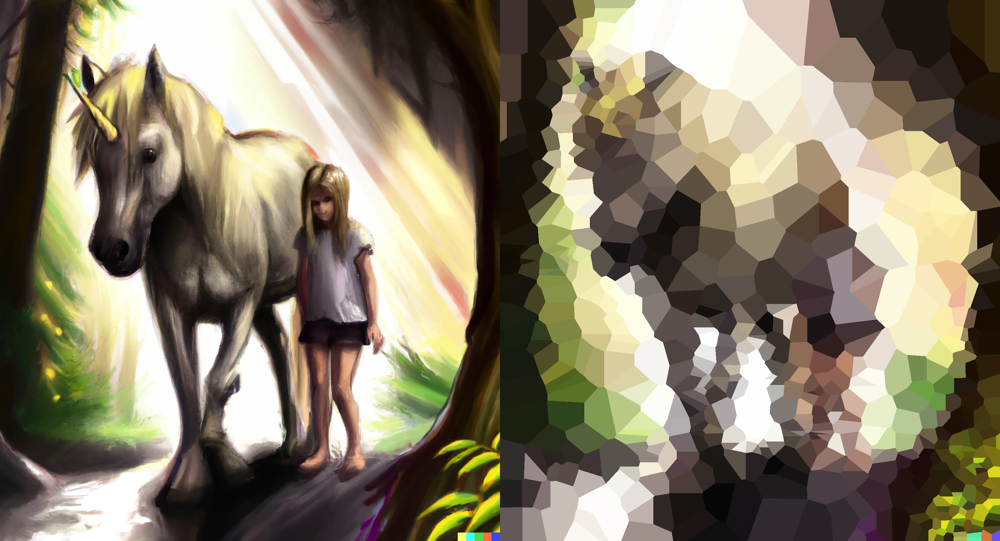
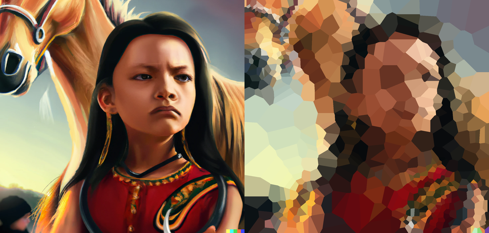
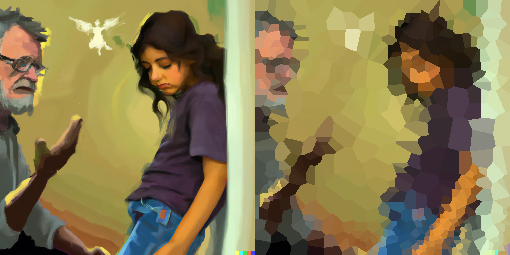
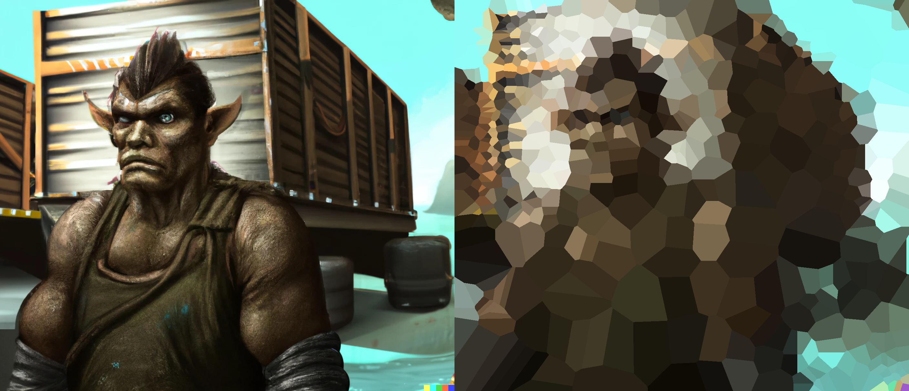

# Voronoizer

Convert any image into a Voronoi diagram.  The result is a set of polygons of
solid color, which can be used as a basis for a mosaic or other artistic
rendering.

## Usage

```
Usage: voronoizer <INPUT FILE> <OUTPUT FILE> <N> <UNIFORMITY> <FOCUS>
```

* `<INPUT FILE>` is the image to be converted.
* `<OUTPUT FILE>` is the name of the output file.
* `<N>` is the base number of regions to use in the Voronoi decomposition.  This
  is a rough estimate of the number of regions to use.  The actual number of
  regions will depend on other parameters.
* `<UNIFORMITY>` is a non-negative number indicating how uniform the size of
  the regions should be.  The higher the number, the more uniform the region
  sizes.
* `<FOCUS>` is a positive number indicating how much to prioritize detail
  near the center of the image versus the edges.  A value of 1 will include
  detail equally throughout the image.  Higher values will prioritize detail
  near the center, and lower values will prioritize detail near the edges.

## Examples









## TODO

1. Improvement of Error Calculation and Decision Making:

* Contrast compensation: Adjust the error thresholds based on the contrast of
  the image, so the number of regions chosen is about the same regardless of
  contrast in the source image.
* Utilize advanced error calculations: Implement more robust measures of
  correctness such as Structural Similarity Index (SSIM) or Multi-Scale
  Structural Similarity Index (MS-SSIM) instead of just Mean Squared Error
  (MSE).
* Incorporate texture analysis: Compute texture descriptors such as Local
  Binary Patterns (LBP), Gray-Level Co-Occurrence Matrix (GLCM), Gabor
  Filters, or Wavelet Transforms to capture texture information. Include a
  texture descriptor as part of your color comparison function to reduce
  over-segmentation in textured areas.

2. Fine Tuning of Voronoi Decomposition:

* Edge detection: Identify prominent edges in the image and move reference
  points to align Voronoi cell boundaries with these edges. This could
  improve both geometric similarity and color accuracy.
* Applying Genetic/Evolutionary Algorithms: After the initial Voronoi
  decomposition, identify specific changes such as adding, deleting, or
  moving reference points based on observed deficiencies, and evaluate them
  to optimize a total quality score.

3. Customization and Flexibility:

* Palettes: Allow the user to specify a set of available colors.  When
  measuring error, look at error versus the nearest available palette color
  to the average color for the region.
* User interface: Allow the user to interactively adjust the number and
  placement of reference points, and to adjust the error thresholds for
  different regions of the image.

4. Performance:

* Parallelization: Use parallelism to speed up the computation of the
  Voronoi decomposition and the error calculation.
* Algorithmic improvements: Construct the Voronoi diagram explicitly to
  avoid iterating per-pixels for computations.  Pre-compute the average color
  of image regions in a quadtree-based map for efficient lookup.
